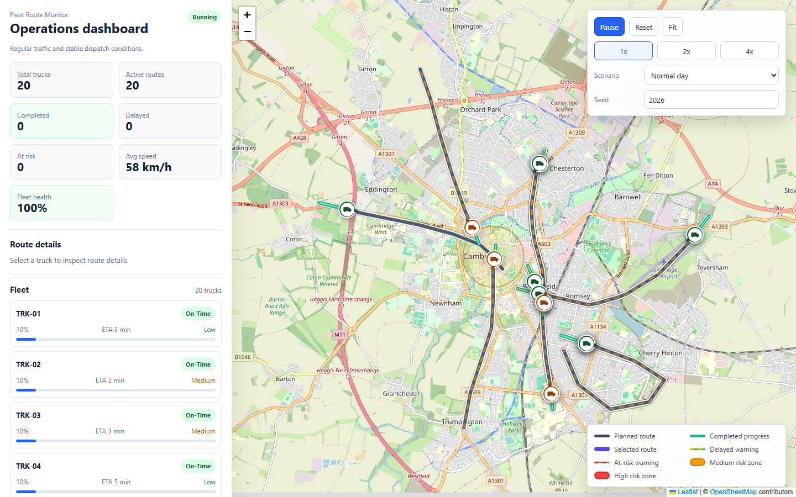

# Fleet Route Monitor

[Live demo](https://johnimril.github.io/leaflet-route/)

Fleet Route Monitor is an interactive logistics control tower built with React, TypeScript, Vite and Leaflet. It simulates real-time truck movement, route progress, ETA calculation, delay risks, scenario changes and operational alerts on a live map.



Mobile and tablet captures are available in [`docs/screenshot-mobile.png`](./docs/screenshot-mobile.png) and
[`docs/screenshot-tablet.png`](./docs/screenshot-tablet.png).

## Features

- Real-time truck movement simulation on a Leaflet/OpenStreetMap map.
- Static road-like route presets around Cambridge for a more realistic map view without routing APIs.
- Deterministic route assignment with an editable seed.
- ETA, progress, distance and delay calculations.
- Simulated delay risk model with operational route statuses.
- Scenario presets: Normal day, Rush hour, Bad weather and Road closure.
- Fleet dashboard metrics and health score.
- Truck list with selected truck details.
- Activity feed with recent operational events.
- Custom SVG truck markers with selected, completed, delayed and at-risk visual states.
- Navigation-style route rendering with casing, progress overlays, selected route highlights and warning accents.
- Route selection, marker popups, fit-all map control and route hover highlighting.
- Map legend and simulated risk zones.
- GitHub Pages deployment via GitHub Actions.

## Tech Stack

- React
- TypeScript
- Vite
- Leaflet
- React Leaflet
- ESLint
- Prettier
- Vitest

## Architecture

The project is split into small layers so the map is not responsible for all product logic:

- `src/simulation/` contains static Cambridge road-like route presets, deterministic route assignment, seeded random, scenario config, ETA/delay/risk calculations and position updates.
- `src/features/fleet-map/` contains Leaflet rendering, truck markers, route lines, controls, legend and the simulation hook.
- `src/features/dashboard/` contains metrics, truck list, selected truck details and activity feed UI.
- `src/shared/` contains small formatting utilities shared by the map and dashboard components.

Static road-like route presets around Cambridge are used to make the simulation visually realistic without requiring paid routing APIs or backend services. ETA and risk values are simulated. They are derived from route progress, current speed, scenario factors, delay bias and risk zone exposure. No backend, routing API or machine-learning model is used.

## Commands

```bash
npm install
npm run dev
npm run build
npm run preview
npm run lint
npm run format:check
npm test
```

## What This Project Demonstrates

- React component architecture for an interactive product UI.
- TypeScript domain modeling for fleet routes, risk levels and simulation events.
- Interactive map UI with Leaflet and React Leaflet.
- Deterministic simulation using a seed and local road-like route presets.
- Derived UI state for progress, ETA, delay and fleet health.
- Real-time animation loop with pause, reset and speed controls.
- Navigation-style map rendering with route progress and operational warning overlays.
- Dashboard UX for scanning fleet state quickly.
- GitHub Pages deployment with Vite `base` configured for `/leaflet-route/`.

## Scope

Fleet Route Monitor is a compact portfolio project. It intentionally does not include a backend, authentication, a database, real routing, live traffic APIs or a large state-management library.
